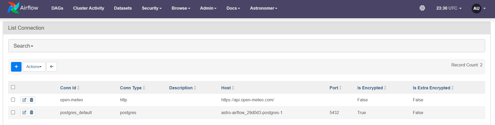
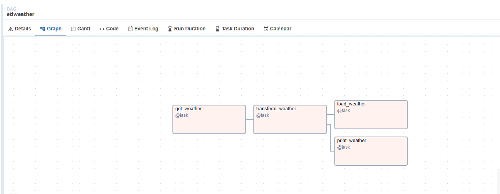
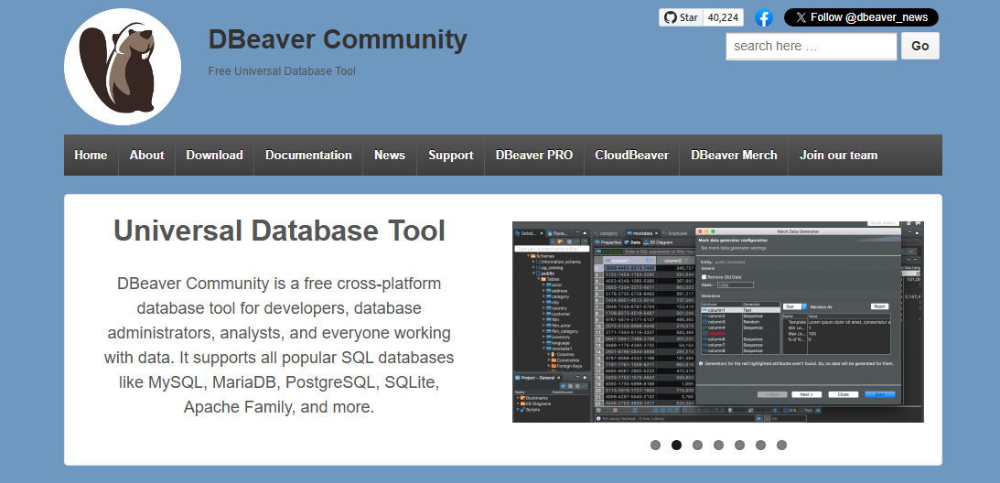

# Astro + Airflow + PostgreSQL ETL Weather Project

This project demonstrates how to build an ETL pipeline using [Astro](https://astro.build/), [Apache Airflow](https://airflow.apache.org/), and PostgreSQL. The pipeline extracts weather data from the [Open-Meteo API](https://open-meteo.com/), transforms it, and loads it into a PostgreSQL database using Airflow DAGs.

## Prerequisites

Before starting, ensure you have the following installed:

- **Docker** (make sure Docker is running)
- **Astro CLI** (installed via Windows Package Manager)
- **DBeaver** (optional, for connecting to PostgreSQL)

## Installation Steps

### 1. Install Astro CLI

To install Astro CLI using the Windows Package Manager (winget), run:

```bash
winget install -e --id Astronomer.Astro
```

### 2. Add Astro to Environment Variables

After installation, add the path to Astro.exe to your system's environment variables. The path should resemble:

"C:\Users\myname\AppData\Local\Microsoft\WinGet\Packages\Astronomer.Astro_Microsoft.Winget.Source_8wekyb3d8bbwe"

### 3. Initialize the Astro Airflow Project

Run the following command to initialize a new Astro project:

```bash
astro dev init
```

This command will create the necessary directory structure for your Astro project.

### 4. Set Up docker-compose.yml and Add the DAG

Create or update the docker-compose.yml file in your project directory to set up PostgreSQL and Airflow.
Place the etl_weather.py DAG file in the dags/ folder of your project.

### 5. Start the Astro Development Environment

Ensure Docker is running and start the Astro development environment by running:

```bash
astro dev start
```

This will start the necessary Docker containers, including Airflow and PostgreSQL. Once the containers are up, the Airflow web interface will automatically open in your browser.



6. Configure Airflow Connections
   To use PostgreSQL and the Open-Meteo API in your Airflow DAG, you need to configure connections in the Airflow UI.

Adding PostgreSQL Connection

1. Navigate to Admin -> Connections in the Airflow UI.
2. Click Add Connection.
3. Set the following details:
   - Connection ID: postgres_default.
   - Connection Type: Postgres.
   - Host: The name of your PostgreSQL container (e.g., postgres).
   - Database: postgres.
   - Login: postgres.
   - Password: postgres.
   - Port: 5432.
4. Click Save.

\
Adding Open-Meteo API Connection \

1. Navigate to Admin -> Connections in the Airflow UI.
2. Click Add Connection.
3. Set the following details:
   - Connection ID: open-meteo.
   - Connection Type: HTTP.
   - Host: https://api.open-meteo.com/.
4. Click Save.

### 7. Run the ETL DAG

In the Airflow UI, navigate to the DAGs tab, find the etl_weather DAG, and trigger it manually. This will extract, transform, and load the weather data from the Open-Meteo API into the PostgreSQL database.



### Verify Data in PostgreSQL

To verify the data has been loaded into PostgreSQL, you can use DBeaver to connect to the PostgreSQL container.



1. Download and Install DBeaver
   DBeaver Community is a free, cross-platform database tool for developers and database administrators. It supports all major SQL databases, including PostgreSQL.

2. Connect to PostgreSQL
   - Open DBeaver and create a new connection.
   - Choose PostgreSQL as the database type.
   - Set the following connection parameters:
     - Host: localhost.
     - Database: postgres.
     - Username: postgres.
     - Password: postgres.
   - Click Test Connection to ensure everything works, then click Finish.

### Query the Data

Once connected, expand the postgres database and locate the weather table. You can query the data by running the following SQL query:

Press Ctrl + Enter to execute the query and see the data from the Open-Meteo API.

### Key Points Covered:

- Detailed step-by-step instructions on setting up Astro, Airflow, and PostgreSQL.
- Configuration for PostgreSQL and Open-Meteo API in the Airflow UI.
- Instructions on verifying data in PostgreSQL using DBeaver.
